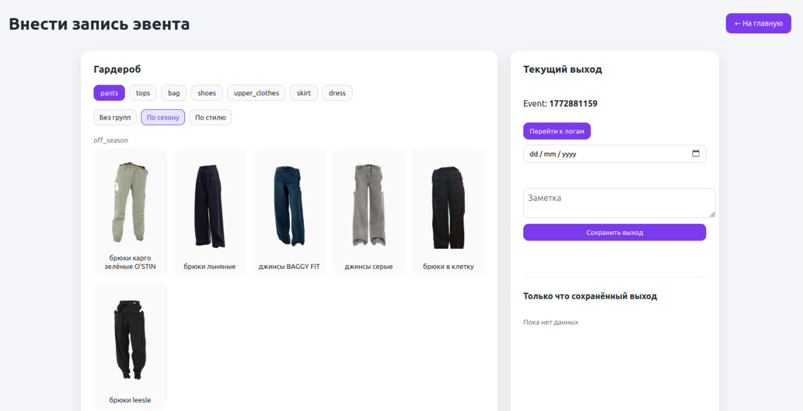
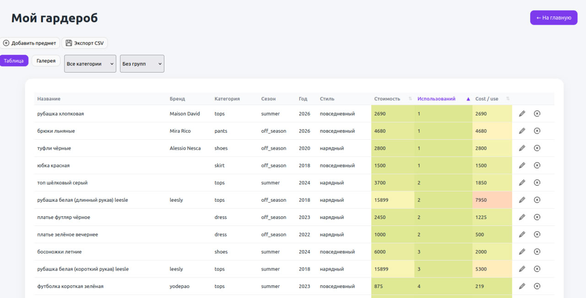
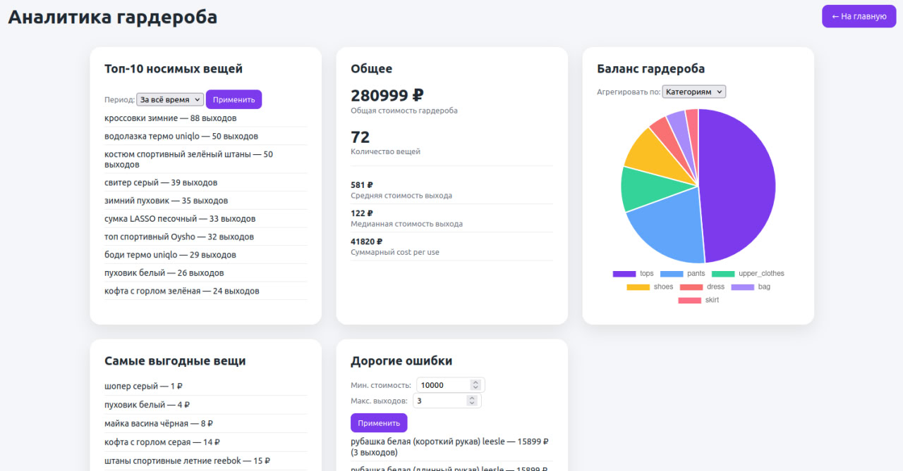

# Pet-project Wardrobe Analyzer

**Wardrobe Analyzer** is a small service for tracking and analyzing a personal wardrobe.

Users can add clothing items with photos and metadata. The system automatically segments garments in the image, allowing the service to build usage statistics over time. By logging when items are worn, the system can compute metrics such as:

- cost per use
- distribution across categories
- seasonal usage
- style composition

This project is intended as a pet project demonstrating computer vision integration in a backend service.

## Segmentation Model

The service uses the pretrained segmentation model
SegFormer B3 Clothes

Model source:
[segformer_b3_clothes](https://huggingface.co/sayeed99/segformer_b3_clothes)
The model was converted to ONNX format for efficient inference inside the service.

## Project Structure
```
wardrobe_api/
├── data
│   ├── Cost_per_use_2025.csv
│   └── garments
│       ├── MP002XW09L2Z_15257329_1_v5.webp
│       ├── MP002XW0APXS_15958912_1_v2_2x.webp
│       ├── MP002XW0BOFD_16459206_1_v1_2x.webp
│       └── XD001XW00YDP_25041029_1_v1_2x.webp
├── docker
│   ├── dbdata
│   ├── docker-compose.yml
│   └── Dockerfile
├── src
│   ├── alembic
│   ├── api
│   ├── core
│   ├── scripts
│   ├── models
│   ├── schemas
│   ├── main.py
│   └── static
├── model_weights
│   └── segformer_b3_clothes.onnx
├── requirements_hard.txt
├── requirements.txt
└── README.md
```

## Running the Project

Start the service using Docker:
```bash
sudo docker compose -f ./docker/docker-compose.yml up --build --detach
```
Open the web interface locally:
http://localhost:3000/static/index.html


To populate the database from a prepared CSV file:
```bash
sudo docker exec -it wardrobe_main_api_backend python src/scripts/load_items_from_csv.py
```
Viewing Logs
```bash
sudo docker logs -f wardrobe_main_api_backend
```

## Screenshots
Below are examples of the web interface and segmentation results.

Web Interface

Garment Table

Wardrobe Statistics


### License Notice

This project uses the SegFormer model developed by NVIDIA.

SegFormer is licensed under the
[NVIDIA Source Code License for SegFormer](https://github.com/NVlabs/SegFormer/blob/master/LICENSE)
The model is restricted to non-commercial use (research and evaluation purposes only).
